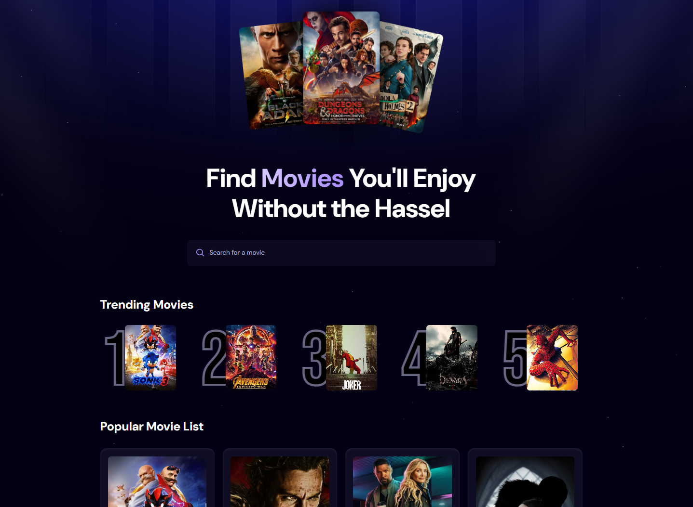
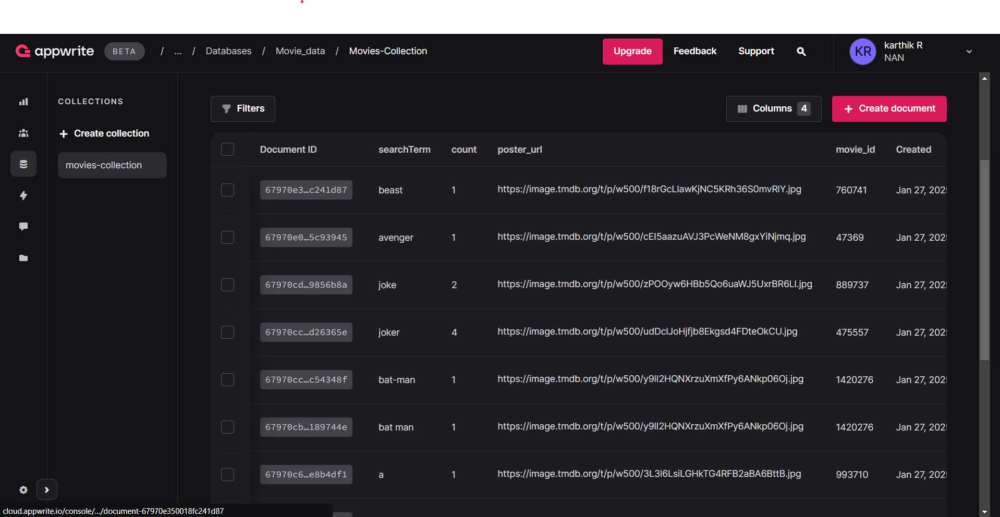
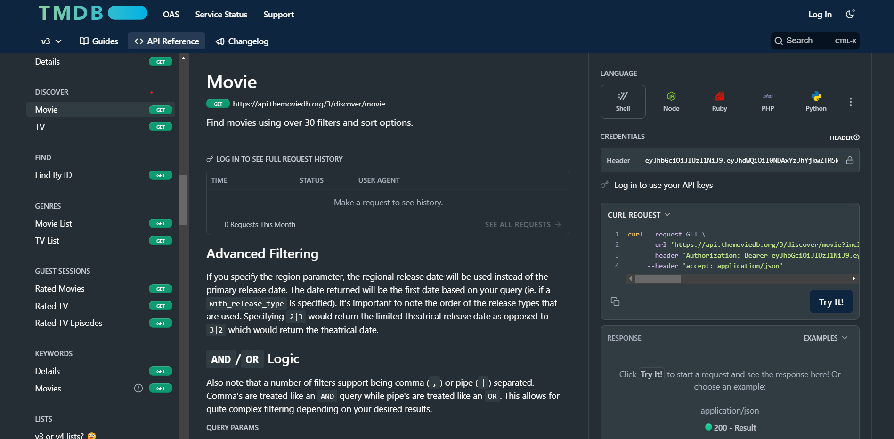

# Movie App

Welcome to the **Movie App**! This project is a dynamic web application built using modern technologies like **React**, **Tailwind CSS**, and **Appwrite**. The app leverages the **TMDB (The Movie Database) API** to fetch and display trending and popular movies, allowing users to explore and search for their favorite films effortlessly.

## Features

### 1. Movie Exploration
- Display trending and popular movies.
- Search functionality to find movies by title or keyword.

### 2. Interactive UI
- Beautiful and responsive design powered by **Tailwind CSS**.
- Optimized for seamless navigation and interaction across devices.

### 3. Data Management
- Backend data handling powered by **Appwrite**.
- Movie data fetched from **TMDB API** and stored in an **Appwrite Collection**.

## Screenshots

### App Interface


### Appwrite Console


### TMDB API Documentation


## Technology Stack

### Frontend:
- **React**: A JavaScript library for building user interfaces.
- **Tailwind CSS**: A utility-first CSS framework for rapid UI development.

### Backend:
- **Appwrite**: An open-source backend server for managing collections, documents, and authentication.

### API:
- **TMDB API**: To fetch movie data including titles, posters, and details.

## Getting Started

### Prerequisites
1. **Node.js** (v16 or later)
2. **Appwrite Server** set up locally or hosted.
3. **TMDB API Key** from [TMDB](https://www.themoviedb.org/).

### Installation

1. Clone the repository:
   ```bash
   git clone https://github.com/yourusername/movie-app.git
   cd movie-app
   ```

2. Install dependencies:
   ```bash
   npm install
   ```

3. Create a `.env` file in the root directory and add the following:
   ```env
   REACT_APP_APPWRITE_ENDPOINT=<YOUR_APPWRITE_ENDPOINT>
   REACT_APP_APPWRITE_PROJECT_ID=<YOUR_APPWRITE_PROJECT_ID>
   REACT_APP_TMDB_API_KEY=<YOUR_TMDB_API_KEY>
   ```

4. Start the development server:
   ```bash
   npm start
   ```

5. Open the app in your browser:
   ```
   http://localhost:3000
   ```

## Appwrite Setup
1. Create a project in Appwrite.
2. Add a collection named `movies-collection` with the following fields:
   - `searchTerm` (String)
   - `count` (Integer)
   - `poster_url` (String)
   - `movie_id` (Integer)
3. Configure Appwrite endpoints and project ID in the `.env` file.

## TMDB Integration
1. Sign up for a TMDB account and generate an API key.
2. Use the API key in the `.env` file to fetch movie data.

## Folder Structure
```plaintext
movie-app/
├── public/
├── src/
│   ├── components/    # Reusable React components
│   ├── pages/         # Page components
│   ├── services/      # API and Appwrite service logic
│   ├── styles/        # Custom styles
│   ├── App.js         # Main App component
│   ├── index.js       # Entry point
├── .env               # Environment variables
├── package.json       # Project configuration
```

## Contributing
Contributions are welcome! If you have any ideas or improvements, feel free to open an issue or submit a pull request.

## License
This project is licensed under the [MIT License](LICENSE).

## Acknowledgments
- **TMDB** for their comprehensive movie database and API.
- **Appwrite** for providing an amazing backend solution.
- **Tailwind CSS** for enabling beautiful designs effortlessly.

---

### Let's Build Something Amazing Together! 🚀

